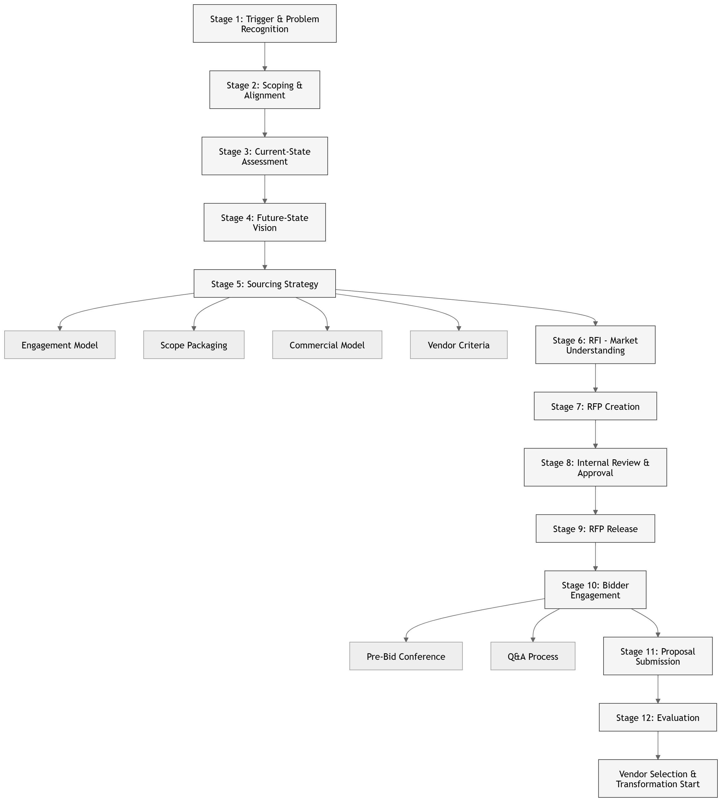

# 🏢 Enterprise RFP Playbook

## 📊 Overview

---

## 📚 Stages

| Stage | Link |
|------|------|
| Stage 1: Trigger & Problem Recognition | [Open](stage-1.md) |
| Stage 2: Scoping & Alignment | [Open](stage-2.md) |
| Stage 3: Current-State Assessment | [Open](stage-3.md) |
| Stage 4: Future-State Vision | [Open](stage-4.md) |
| Stage 5: Sourcing Strategy | [Open](stage-5.md) |

---
